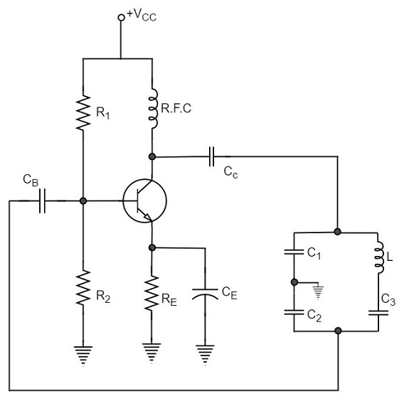
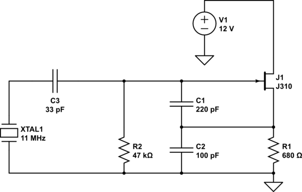

# 8. Transmitters

> TODO: Complete this chpater

## Definitions

- **Oscillator** are circuits that continually generates a signal at a given frequency.

## Notes

For oscillation to occur certain conditions must be met:

- transistor must have enough gain (amplification)
  - to overcome feedback losses
- feedback must be in the correct phase
  - must be positive feedback

To obtain the correct feedback to ensure oscillation:

- Mutual inductance (transformer action) between the coils in the input and output circuits
- Feedback circuit from output to input
- Tapped coil. Part of the coil is in the input circuit and part of the coil is in the output circuit.

TODO: [Clapp oscillator](https://en.wikipedia.org/wiki/Clapp_oscillator) - it came out in the exams

## Types of oscillator circuits

##### Colpitts Oscillator 

- Circuit of a Colpitts Oscillator, using a crystal:

 
 
- Circuit of a Colpitts Oscillator, using a series LC network:

 

fout = 1 / (2 * pi * sqrt(L * Ct))

Ct = total capacitance = (100 * 100 )/ (100 + 100) = 50, as capacitors are in series

##### Clapp Oscillator
With LC circuit

With crystal

fout = 1 / (2 * pi * sqrt(L * Ct))

Ct = total capacitance = 1 / (1/C1 + 1/C2 + 1/C3)
But C3 (extra one compared with colpitts) is usually much smaller so Ct = C3